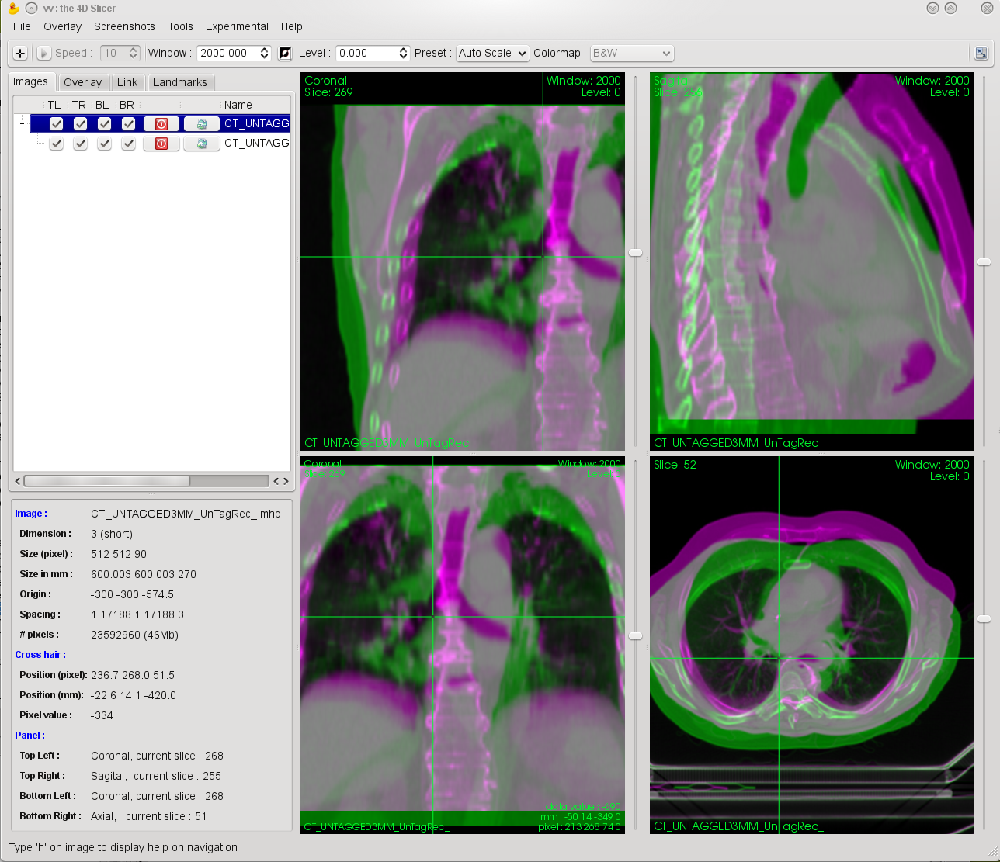

_David Sarrut, Pierre Seroul, Joël Schaerer, Simon Rit, Jef Vandemeulebroucke, Thomas Baudier, Bharath Navalpakkam, Gauthier Bouilhol, Romulo Pinho, Vivien Delmon and Maxime Pech_,  **[vv[at]creatis.insa-lyon.fr](mailto:vv@creatis.insa-lyon.fr)** ([Mailing List Subscription](http://www.creatis.insa-lyon.fr/mailman/listinfo/vv))

[Bug Tracker](https://github.com/open-vv/vv/issues),  [Travis CI](https://travis-ci.org/open-vv/vv/branches).

----------

## 1. VV ?

VV is an open-source and cross platform image viewer, designed for  **fast**  and  **simple**  visualization of spatio-temporal images: 2D, 2D+t, 3D and 3D+t (or 4D) images. VV runs (at least!) on Linux, Windows and Mac OS in 32 and 64 bits.

VV is more specifically designed for qualitative evaluation of image registration and deformation field visualization. It contains several tools for superimposing images using complementary colors or transparency, visualizing vector fields and defining landmarks. With a modern graphic card, navigation is fast and smooth.

VV is distributed under two open source licenses:  [BSD](http://www.opensource.org/licenses/bsd-license.php)  and  [CeCILL-B license](http://www.cecill.info/licences/Licence_CeCILL-B_V1-en.html)  from the CNRS, without restrictions and without warranty. Feel free to use it as you like! We would like to encourage you to share your experience by sending an email to  [vv[at]creatis.insa-lyon.fr](mailto:vv@creatis.insa-lyon.fr)  briefly describing your use of vv. When using it for publications, please make reference to the article:

-   Seroul, P. and Sarrut, D.  _VV : Viewer for the evaluation of 4D image registration._  **2008.**  presented at the MICCAI workshop Systems and Architectures for Computer Assisted Interventions.  [pdf](https://www.creatis.insa-lyon.fr/~baudier/vv/MICCAI2008.pdf "pdf")  [bibtex](https://www.creatis.insa-lyon.fr/~baudier/vv/MICCAI2008.bib "bibtex")
    

This work is still in progress, we welcome any advice or opinions that can make this software more useful.




----------

Contents

1.  [VV ?](#1-vv-)
2.  [Download VV](#2-download-vv)
3.  [Compiling VV ... where to begin?](#3-compiling-vv--where-to-begin)
4.  [Feature overview](#4-feature-overview)
5.  [FAQ](#5-faq)
6.  [Developers](#6-developers)

## 2. Download VV

### 2.1. Binaries

_Binaries are provided without any warranty_. We advise you to compile it yourself.

Latest release is v1.4 (October 2016 / updated March 2018):

-   [Linux 64 bits with Qt4](https://www.creatis.insa-lyon.fr/~baudier/vv/vv-1.4Qt4-linux64.tar.gz "Linux 64 bits with Qt4")  (tar xzvf vv-1.4Qt4-linux64.tar.gz to extract it)
    
-   [Windows 32 bits with Qt4](https://www.creatis.insa-lyon.fr/~baudier/vv/vv-1.4Qt4-win32.zip "Windows 32 bits with Qt4")  (For Windows, prefer to use the Docker image)
    
-   [Windows 64 bits with Qt4](https://www.creatis.insa-lyon.fr/~baudier/vv/vv-1.4Qt4-win64.zip "Windows 64 bits with Qt4")  (For Windows, prefer to use the Docker image)
    

v1.3 (October 2012).

An archlinux package named vv is available through AUR.

-   [Linux 32 bits](https://www.creatis.insa-lyon.fr/~baudier/vv/vv-1.3-linux32.sh "Linux 32 bits")
    
-   [Linux 64 bits](https://www.creatis.insa-lyon.fr/~baudier/vv/vv-1.3-linux64.sh "Linux 64 bits")
    
-   Windows 32 bits  [zipped](https://www.creatis.insa-lyon.fr/~baudier/vv/vv-1.3-win32.zip "zipped")  or  [installer](https://www.creatis.insa-lyon.fr/~baudier/vv/vv-1.3-win32.exe "installer")
    
-   Windows 64 bits  [zipped](https://www.creatis.insa-lyon.fr/~baudier/vv/vv-1.3-win64.zip "zipped")  or  [installer](https://www.creatis.insa-lyon.fr/~baudier/vv/vv-1.3-win64.exe "installer")
    

v1.2 (May 2011).

-   [Linux 64 bits](https://www.creatis.insa-lyon.fr/~baudier/vv/vv-1.2-linux64.sh "Linux 64 bits")
    
-   Windows 32 bits  [zipped](https://www.creatis.insa-lyon.fr/~baudier/vv/vv-1.2-win32.zip "zipped")  or  [installer](https://www.creatis.insa-lyon.fr/~baudier/vv/vv-1.2-win32.exe "installer")
    
-   Windows 64 bits  [zipped](https://www.creatis.insa-lyon.fr/~baudier/vv/vv-1.2-win64.zip "zipped")  or  [installer](https://www.creatis.insa-lyon.fr/~baudier/vv/vv-1.2-win64.exe "installer")
    

v1.1 (July 2010).

-   [Linux 64 bits binaries](https://www.creatis.insa-lyon.fr/~baudier/vv/vv-1.1-linux64.sh "Linux 64 bits binaries")
    
-   [Linux 32 bits binaries](https://www.creatis.insa-lyon.fr/~baudier/vv/vv1.1_32bit_Linux.tar.gz "Linux 32 bits binaries")
    
-   Windows 32 bits  [zipped](https://www.creatis.insa-lyon.fr/~baudier/vv/vv-1.1-win32.zip "zipped")
    
-   Windows 64 bits  [zipped](https://www.creatis.insa-lyon.fr/~baudier/vv/vv-1.1-win64.zip "zipped")
    

### 2.2. Source code

The latest source code is available in a git repository. To download it, run:

git clone https://github.com/open-vv/vv.git vv

### 2.3. Docker

You can download a  [docker image](https://hub.docker.com/r/tbaudier/vv/)  of vv. After install Docker, you just have to do (2GB):

```bash
systemctl start docker
docker pull tbaudier/vv
```

And to lauch vv with the Docker:

```bash
systemctl start docker
docker run -ti --rm -e DISPLAY=$DISPLAY -v /tmp/.X11-unix:/tmp/.X11-unix -v /home/tbaudier:/home tbaudier/vv
```

### 2.4. Examples of data

Click  [here](http://www.creatis.insa-lyon.fr/~dsarrut/vv)  to download examples of images.

----------

## 3. Compiling VV ... where to begin?

In order to compile VV you need the following third party software:

-   [CMake >= 2.8.8](http://www.cmake.org/)
    
-   [Qt >= 5](https://www.qt.io/)  You can also use Qt4 with the same instruction. (In VTK, you just have to indicate the correct Qt_Version)
    
-   [VTK >= 6.0.0](http://www.vtk.org/)
    
-   [ITK >= 4.6.0](http://www.itk.org/)
    
-   The  [Gengetopt](http://www.gnu.org/software/gengetopt/gengetopt.html)  dependency is now optional, source code has been included in the vv source repository.
    

A  [separate page](https://github.com/open-vv/vv/blob/master/vv_static.md)  details specific instructions to compile it statically, i.e. without links to  [dynamic libraries](http://en.wikipedia.org/wiki/Dynamic-link_library). The following instructions are linux/gcc oriented but it is easy to translate them to other OS/compilers.

### 3.1. CMake

CMake is a family of tools designed to build, test and package software.

You can download pre-compiled binaries and the source code  [here](http://www.cmake.org/cmake/resources/software.html)  or via git:

```bash
git clone git://cmake.org/cmake.git
```

Installation instructions are available  [here](http://www.cmake.org/Wiki/CMake).

CMake is used to build ITK, VTK and VV.

### 3.2. QT

Qt is a cross-platform application development framework widely used for the development of GUI programs.

We recommend you to install Qt5-devel and widget development library (Designer, Xml, Tools, Gui, Network, OpenGL, ...) with your package manager (e.g.: apt-get, Yum, Yast, ...)

You can download pre-compiled binaries or the source code  [here](https://www.qt.io/download/)  or via git:

```bash
git clone git://code.qt.io/qt/qt.git
```

A working version can be download  [here](https://www.creatis.insa-lyon.fr/~baudier/vv/qt5.tar.gz "here")  (.tar.gz) or  [here](https://www.creatis.insa-lyon.fr/~baudier/vv/qt5.zip "here")  (.zip).

To compile it, you can try:

```bash
./configure -opensource -confirm-license -nomake examples -nomake tests -no-gtkstyle -qt-xcb
make -j4
make install
```

### 3.3. VTK

The Visualization Toolkit (VTK) is an open-source, freely available software system for 3D computer graphics, image processing and visualization.

VV is tested with VTK. You can download the source code  [here](http://www.vtk.org/VTK/resources/software.html)  or via git. We recommend you to use version 9.0.1:

```bash
git clone https://github.com/Kitware/VTK.git vtk
cd vtk
git checkout v9.0.1
cd ..
```

Create a binary directory, get into it and run CMake:

```bash
mkdir vtk-binary
cd vtk-binary
ccmake ../vtk
```

You need to change the following build options for VV:

```bash
Module_vtkGUISupportQt=ON
Module_vtkGUISupportQtOpenGL=ON
Module_vtkRenderingQt=ON
Module_vtkViewsQt=ON
VTK_RENDERING_BACKEND=OpenGL
VTK_QT_VERSION=5
All Qt5...DIR to /usr/local/Qt-5.../lib/cmake/QT5...
```

And finally, compile it:

```bash
make
```

NB:

-   Be sure you use OpenGL1, maybe you need to change 
```bash
VTK_OPENGL_VERSION to 1
```
-   With VTK version >= 7.1.0
```bash
VTK_Group_Rendering:BOOL=ON
```
-   If you don't have all Qt5 Modules, prefer to set on the previous module instead of VTK_Group_Qt.
-   You need to specify the Qt path selecting the  QT_QMAKE_EXECUTABLE  binary if it is not done automatically. More specially:
```bash
Qt5_DIR="/usr/local/Qt-5.../lib/cmake/Qt5"
Qt5Designer_DIR="/usr/local/Qt-5...lib/cmake/Qt5Designer"
Qt5Xml_DIR="/usr/local/Qt-5.../lib/cmake/Qt5Xml"
Qt5Network_DIR="/usr/local/Qt-5.../lib/cmake/Qt5Network"
```
-   If you are using a MAC OS, you need to enable the option VTK_USE_COCOA or VTK_USE_CARBON.

### 3.4. ITK

To compile ITK from git: We recommend you to use version 5.2.1:

```bash
git clone https://github.com/InsightSoftwareConsortium/ITK.git itk
cd itk
git checkout v5.2.1
cd ..
```

Create a binary directory, get into it and run CMake:

```bash
mkdir itk-binary
cd itk-binary
ccmake ../itk
```

In CMake, change the following settings:

```bash
BUILD_SHARED_LIBS=ON
Module_ITKVtkGlue=ON
```

You need to specify the VTK path if it is not done automatically. More specially:

```bash
VTK_DIR="/VTK/VTK_bin"
```

And finally, compile it:

```bash
make
```

### 3.5. VV

Finally, to compile VV from git:

```bash
git clone https://github.com/open-vv/vv.git vv

mkdir vv-binary
cd vv-binary
ccmake ../vv
make
```

You have to set the correct paths to ITK binaries and Qt5 into ccmake prompt

----------

## 4. Feature overview

### 4.1. Image IO

VV open and display images of various file formats :

-   In 2 dimensions : hdr, mhd, jpeg, bmp, png, tiff, dicom...
-   In 3 dimensions : hdr, mhd, dicom...
-   In 4 dimensions : hdr, mhd, dicom...

Note the explicit distinction between 3D and 2D+t images. VV allows the reinterpretation of any n dim image as a (n-1) dim +t image. Any loaded image can be saved as another file format through the "save-as" menu.

VV also contains a minimal Dicom Browser to open images series (which works sometimes).


A 'play mode' is also available for temporal images in order to navigate into images during motion.

You can call vv with command line in a prompt:

<table>
<thead>
<tr>
<th colspan="2"></th>
</tr>
</thead>
<tbody>
<tr>
<td> --help </td>
<td> Print command line help and exit. </td>
</tr>
<tr>
<td> --window number </td>
<td> Gray scale window width for set of images appearing before in the cmd line (may appear more than once). </td>
</tr>
<tr>
<td> --level number </td>
<td> Gray scale window level for set of images appearing before in the cmd line (may appear more than once). </td>
</tr>
<tr>
<td> --linkall </td>
<td> Link pan, zoom and spatial position of crosshair in images. </td>
</tr>
<tr>
<td> --log </td>
<td> Log output messages in vv-log directory. </td>
</tr>
<tr>
<td> --state file </td>
<td> Read display parameters from file. </td>
</tr>
<tr>
<td> --sequence file </td>
<td> Read all file(s) until next option in a single temporal sequence. </td>
</tr>
<tr>
<td colspan="2"> These last options must follow a file name since they overlay something on an image: </td>
</tr>
<tr>
<td> --vf file </td>
<td> Overlay the vector field in file. </td>
</tr>
<tr>
<td> --overlay [--sequence] file(s) </td>
<td> Overlay the image in file with complementary colors. </td>
</tr>
<tr>
<td> --fusion [--sequence] file(s) </td>
<td> Overlay the image in file with alpha blending and colormap. </td>
</tr>
<tr>
<td> --contour file </td>
<td> Overlay DICOM RT-STRUCT contours. </td>
</tr>
<tr>
<td> --landmarks [--sequence] file(s) </td>
<td> Overlay the landmarks in file(s) (.txt or .pts). </td>
</tr>
</tbody>
</table>

### 4.2. Registration evaluation

Five different tools for the qualitative and quantitative evaluation of registration are available. These tools work for 2D, 3D and 4D images.

#### 4.2.1. Synchronized navigation

Probably the most simple but useful tool to visualize and compare up to four images at the same time. By combining the four different viewer panels and temporal capabilities, sophisticated synchronized navigation between several images orientations or time sequences can be achieved. Pixel values of each synchronized images at current cursor position are available.

#### 4.2.2. Image fusion with complementary-colors

One conventional approach to qualitatively evaluate the result of an image registration procedure consists in comparing the reference image with the other image deformed by the sought transformation. Overlapping the two images allows to visualize the differences between the reference and registered images. VV provides an image fusion tool which merges two images into a single one : the image differences are enhanced with two different colors (for positive and negative differences) while the pixel color tends to the original grey levels when differences are low. Such approach is similar to the one used in the XVI software from Elekta which has proven useful for image comparison. The choice of the two complementary colors can be customized by the user with a simple slider. Both spatial (between slice) and temporal navigation remains as previously described. Pixel values and difference values at current cursor position are indicated in the left panel. This feature is for example used to overlay a reference 3D image onto a 4D image in order to appreciate the organs displacement with respect to the reference.

#### 4.2.3. Image fusion by transparency

The last image comparison tool consists in superimposing two images with a given user-defined opacity value and colormap. Such feature is for example used for image comparison in the field of registration procedure, but is also used, in the field or radiation therapy, to superimpose computed dose distributions onto an anatomical image. Multimodality registration could also benefit from this tool. Pixel intensity range of the fusion image must be between [0-1000] (that will be changed in the future).

#### 4.2.4. Deformation field visualization

Deformable registration results are often obtained in the form of deformation fields which represent the displacement of each image pixel from the reference image to the other image. In addition to quantitative analysis, we believe that it is important that researchers and clinicians can visualize such data. Conventional image differences such as the one described previously allow a fast evaluation of the registration result. However, it is well known that, as deformable registration is an ill-posed problem,a perfect match between the deformed image and the reference image can be obtained even though the deformation field itself is false. In order to evaluate a given registration, it is thus required to appreciate not only image differences but also the deformation field itself. However, it is not easy to visualize such a large amount of data : for example a typical deformation field encompassing the breathing motion of a 4D CT image of the thorax is a R3  -> R4  function, which can be represented by a 512*512*141*10 3D vectorial image [popi-model](https://github.com/open-vv/popi-model). VV allows to load and display such data by superimposing on a given slice a set of 2D arrows representing the displacement vector at each point, projected according to the slice orientation. The sampling of the deformation field can be modified to increase or decrease the number of displayed vectors. This is for example useful when zooming (more vectors can be displayed when a large zoom factor is used), or to adapt the navigation speed according to the hardware capabilities. Components and norm of the displacement vector at current mouse position is continuously displayed in the 'Overlay' tab. In our group, this tool is used to quickly evaluate the results of a deformable registration algorithm or helps clinicians to quantitatively evaluate the displacement of a specific point in the image.

#### 4.2.5. Landmark placement

The previously described features are mainly dedicated to qualitative and visual analysis. One of the most common ways to evaluate quantitatively a registration consists in computing the distance between anatomical landmarks defined by experts on both images to be registered. The tab 'landmarks' allow very simple landmarks selection : the physicians should press the space bar at the current mouse location to define a landmarks, displayed on the image. The set of labels can then be saved in a text file for further evaluation study.

### 4.3. Misc tools

-   **Pixel conversion**: to convert the pixel type of an image, right click on the image name on the left panel, choose 'convert'.
    
-   **Image resampling**: in menu 'tool', choose resample with various option.
    
-   **Image Arithmetic**: to perform simple image unary or binary operation (addition, substraction ...)
    
-   **Binarize Image**: apply simple threshold (with interactive feedback)
    
-   **Crop Image**: crop an image
    
-   **Dicom RT Struct import**: in the menu 'file', select Open DicomRT Struct. Choose the different contours to be superimposed to the current image.
    

----------

### 4.4. Alternative/related software

The following software can also be used to display medical images :

-   [3D slicer](http://www.slicer.org/)
    
-   [Amide](http://amide.sourceforge.net/)
    
-   [FusionViewer](http://www.insight-journal.org/midas/view_item.php?itemid=2097)
    
-   [MedInria](http://www-sop.inria.fr/asclepios/software/MedINRIA/)
    
-   [Mricro](https://crnl.readthedocs.io/)
    
-   [Osirix](http://www.osirix-viewer.com/)
    

----------

## 5. FAQ

Here are a few known problems that we have encountered in the past. However if you do fall upon any new bug please feel free to report it  [here](https://github.com/open-vv/vv/issues).

-   Graphic cards and binaries

Binaries that you can download on this page are generated with specific Graphic Cards. Using these, the software may not work as fast as it is supposed to. That is why we advise you to compile your own VV version using source code. This way, it will be adapted to your own Graphic Card.

-   Windows memory allocation failure

On win32 operating systems, memory allocation for a process is limited to 2Gb. Furthermore, when loading an image, memory must be allocated in a contiguous way. Using full resolution data, you may encounter problems opening images with the error message : " ... Description: Failed to allocate memory for image."

For now, the only way to shunt this problem is to use split files and to open them using menu "Merge images as one". 64 bits operating systems do not have such a limit.

-   Compiz

On Linux, using vv with Compiz or advanced graphical desktop features have sometimes shown large degradation in performance. With NVIDIA card, you may have to use the following configuration option before using vv :

```bash
nvidia-xconfig --composite
nvidia-xconfig --render-accel
nvidia-xconfig --add-argb-glx-visuals -d 24
```

-   Bug with Nvidia drivers > 275.09.21 and < 295.20
    

Some bugs in NVidia drivers affects vv with certain NVidia's card, leading to segfault on image rendering. Desactivating multithreading in OpenGL solves some of these bugs. You can do it with the following command :

```bash
export __GL_SINGLE_THREADED=1
```

To completely solves NVidia's issues you can download a recent nvidia driver >= 295.20

-   What should I add to my .bashrc to exclude .raw files from the completion for vv?

```bash
complete -A file -X '*.raw' vv
```

-   I get a linking error related to libtiff when linking vv. What can I do ?

```bash
Set ITK_USE_SYSTEM_TIFF to ON
```

-   All the icons are invisible, what's wrong?

Different PNG and/or zlib libraries are used by vtk, gdcm, itk, qt and/or vv. Change itk and vtk cmake options, e.g., for ITK, to

```bash
ITK_USE_SYSTEM_PNG:BOOL=ON
ITK_USE_SYSTEM_ZLIB:BOOL=ON
```

-   I want to use Qt5 with the code sources. What do I need to install?

With Linux, you have to install some complementary Qt5 libraries. You can find them with your favourite package manager:

```bash
libqt5WebKit5-dev
libqt5WebKitWidgets5-dev
qttools5-dev (or libqt5-qttools-devel)
qttools5 (or libqt5-qttools)
```

But a problem of pointer slowness can be detected. In a such case, we recommend you to install Qt5 using the source available  [here](https://www.creatis.insa-lyon.fr/~baudier/vv/qt5.tar.gz "here")  and follow the instruction in the compilation section.

-   I want to use clitk tools, how it works?

You can build clitk tools to use main functionality of vv with command line. A help for all tools is available [here](https://github.com/open-vv/vv/blob/master/clitk_tools.md).

-   I have this error during compilation: VCL_STATIC_CONST_INIT_FLOAT_DECL?

Be sure to compile vv with a version of gcc using an older version of c++ than c++11.

-   vv doesn't display the same voxel value between cross pointer panel and mouse information overlay.

We know, it's a choice. The voxel value display in the cross pointer panel is the value of the interpolated image (eg.: after a registration) and the mouse pointer value is the original one.

## 6. Developers

**Want to help ?**  You can contribute by posting bugs or feature requests to:  [Bug Tracker](https://github.com/open-vv/vv/issues).

You could also subscribe to our VV mailing list and follow the latest developments and features via  [Mailing List](http://www.creatis.insa-lyon.fr/mailman/listinfo/vv)

### 6.1. Coding style

-   2 spaces indentation, no tab characters, unix line ending
-   Unix block format:

```bash
void Foo(bool isFoo)
{
  if (isFoo) {
    bar();
  } else {
    anotherBar;
  }
}
```

-   Case
    -   Preprocessor defines and macros in upper case;
    -   Member functions start with an upper case.
-   Naming:
    -   Member variables start with m;
    -   Classes, types, iterators, etc... should follow  [ITK](http://www.itk.org/Wiki/images/c/c6/ITKStyle.pdf)  or  [VTK](http://www.cmake.org/Wiki/VTK_Coding_Standards)  code style.
        
-   Comments
    -   Put a dash line before and after the function definition:

```bash
//--------------------------------------------------------------------
void myFunc()
{
}
//--------------------------------------------------------------------
```

[astyle](http://astyle.sourceforge.net/astyle.html)  can be used to reset a file:

```bash
astyle --lineend=linux --indent=spaces=2 --brackets=linux --keep-one-line-statements toto.cxx
```

or a bunch of files:

```bash
find -iname "*.?xx" -exec astyle --lineend=linux --indent=spaces=2 --brackets=linux --keep-one-line-blocks {} \;
```

Note that kitware uses  [uncrustify](http://www.itk.org/Wiki/ITKv4_StyleChangeProposal)  for its code.

